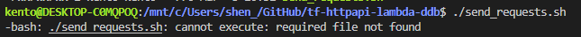
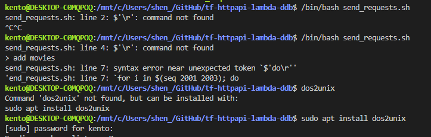

# Commands to invoke api
```bash
# Add movie
INVOKE_URL=https://xxxxxxx.amazonaws.com
curl \
  -X PUT \
  -H "Content-Type: application/json" \
  -d '{"year": "2025", "title": "The Avengers"}' \
  ${INVOKE_URL}/topmovies

# Get movie for a particular year
curl ${INVOKE_URL}/topmovies/2013

# Get listing
curl ${INVOKE_URL}/topmovies

# Delete movie for a particular year
curl -X DELETE ${INVOKE_URL}/topmovies/2013
```


# Missing dependancy Error:
  
   
Resolution:   



